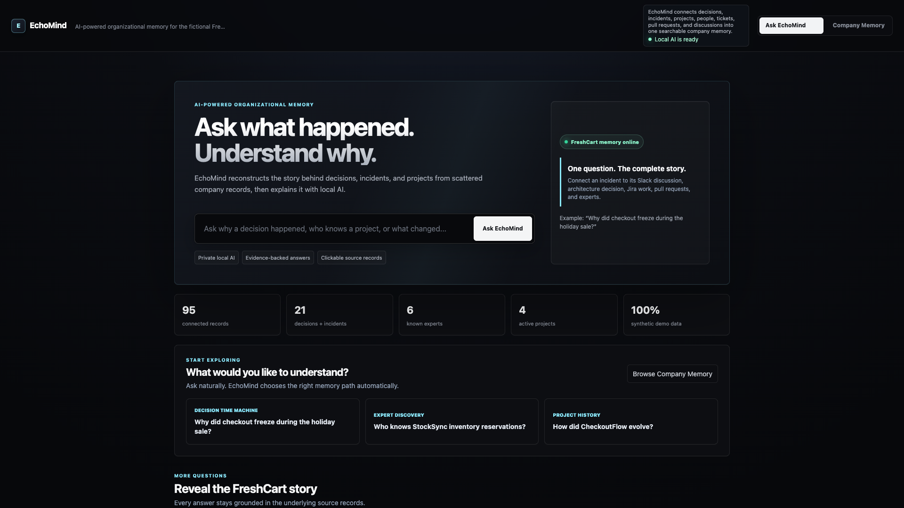
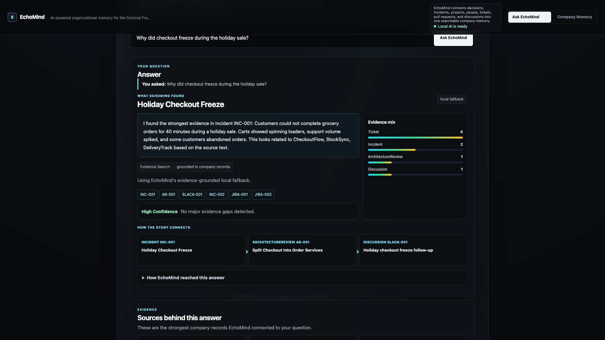
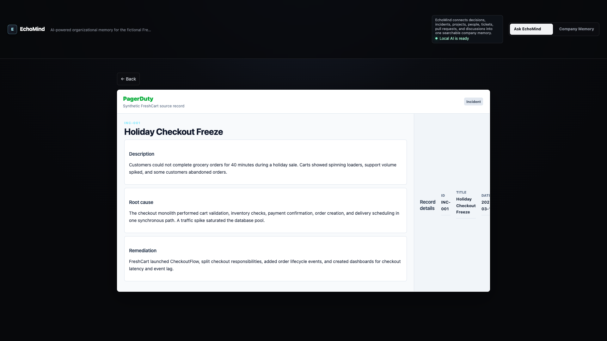
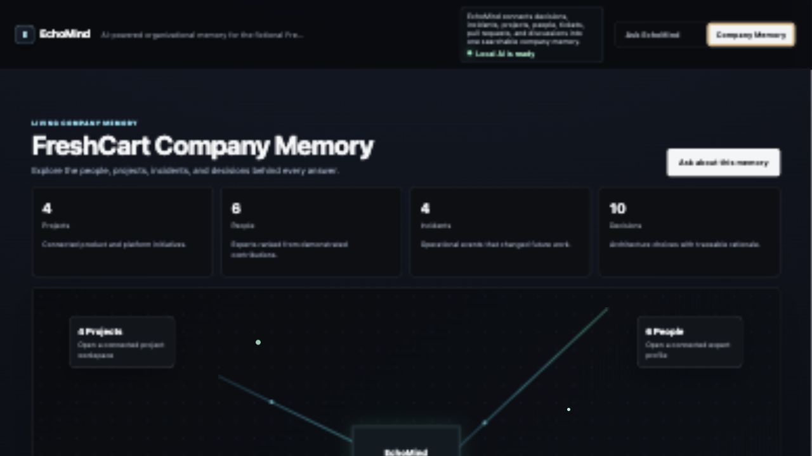

# EchoMind

> Ask what happened. Understand why.

EchoMind is an AI-powered organizational memory platform. It connects architecture reviews, incidents, Jira tickets, pull requests, and team discussions so people can understand why decisions were made, find the right experts, and reconstruct how projects evolved.

The current hackathon demo uses fully synthetic data for **FreshCart**, a fictional grocery-delivery company. It is safe to demonstrate publicly and works without connecting to real company systems.



## Why EchoMind

Organizations document a lot but remember very little. Important context is scattered across tools:

- The decision is recorded in an architecture review.
- The motivation is buried in an incident report.
- Tradeoffs were discussed in Slack.
- Implementation happened through Jira tickets and pull requests.
- The people who understand it best may no longer be obvious.

EchoMind turns those disconnected records into a searchable, evidence-backed company memory.

## Core Experiences

### Ask EchoMind

Ask natural-language questions instead of navigating separate tools. EchoMind retrieves connected records, builds an evidence-grounded answer, displays confidence, and links to every supporting source.

Example questions:

- `Why did checkout freeze during the holiday sale?`
- `Who knows StockSync inventory reservations?`
- `How did CheckoutFlow evolve?`
- `Who is the most important person on the team?`
- `How is StockSync connected to DeliveryTrack?`

### Decision Time Machine

Explains why an architectural decision was made and connects it to the incidents, discussions, alternatives, and implementation work that shaped it.

### Expert Discovery

Identifies experts using demonstrated contributions across tickets, pull requests, reviews, discussions, and incident response rather than relying only on job titles.

### Timeline Explorer

Reconstructs a project's chronological story across incidents, decisions, architecture reviews, tickets, and pull requests.

### Company Memory

Provides a browsable overview of projects, people, incidents, and decisions, including an interactive memory map and connected detail views.

### Traceable Source Records

Every citation opens a synthetic source-style view representing Jira, GitHub, Slack, PagerDuty, or Confluence. Answers remain explainable and auditable.

## Product Walkthrough

### 1. Ask a Question

Start with the question a teammate would naturally ask. EchoMind chooses the appropriate retrieval path without requiring a separate expert-finder or timeline workflow.


### 2. Review the Evidence-Backed Answer

The answer appears directly below the question with confidence, source mix, citations, and the strongest connected records.



### 3. Inspect the Original Source

Every citation opens a source-style record so the explanation can be checked against the underlying evidence.



### 4. Explore Company Memory

The memory map provides a browsable view of projects, people, incidents, and decisions for moments when the user does not yet know what to ask.



## Current Demo

The recommended hackathon experience is the self-contained demo server:

```text
scripts/run_demo.py
```

It provides:

- The polished frontend at `http://localhost:5173`
- JSON APIs used by the frontend
- Retrieval and evidence ranking over the synthetic dataset
- Local Ollama and optional OpenAI integration
- A deterministic fallback when no AI provider is available
- No required package installation
- No required Neo4j, Spring Boot, or FastAPI process

This mode is designed to be reliable during a live presentation.

## Quick Start

### Requirements

- Python 3.9 or newer
- Optional: Ollama for local AI-generated explanations

### Run the Demo

From the `echomind` directory:

```bash
python3 scripts/run_demo.py
```

Open:

```text
http://localhost:5173
```

Stop the server with `Ctrl+C`.

## Enable Local AI With Ollama

EchoMind works without AI using its evidence-grounded fallback. Ollama makes the final answer more conversational while keeping processing local.

### 1. Install Ollama

Download Ollama from:

```text
https://ollama.com
```

### 2. Pull a Model

The demo defaults to the small, fast model used during development:

```bash
ollama pull qwen2.5:0.5b
```

For higher-quality answers on a capable machine:

```bash
ollama pull llama3.2:3b
```

### 3. Start Ollama

```bash
ollama serve
```

### 4. Start EchoMind

In a second terminal:

```bash
ECHOMIND_AI_PROVIDER=ollama \
OLLAMA_MODEL=qwen2.5:0.5b \
python3 scripts/run_demo.py
```

To use the larger model, replace `qwen2.5:0.5b` with `llama3.2:3b`.

## Optional OpenAI Integration

The demo can use the OpenAI Responses API instead of Ollama:

```bash
export OPENAI_API_KEY="your-api-key"
export ECHOMIND_AI_PROVIDER=openai
export OPENAI_MODEL=gpt-4o-mini
python3 scripts/run_demo.py
```

API usage is billed separately by OpenAI. Never commit API keys to the repository.

Supported provider settings:

| Variable | Default | Options |
| --- | --- | --- |
| `ECHOMIND_AI_PROVIDER` | `auto` | `auto`, `ollama`, `openai`, `local` |
| `OLLAMA_BASE_URL` | `http://localhost:11434` | Any compatible Ollama URL |
| `OLLAMA_MODEL` | `qwen2.5:0.5b` | Any installed Ollama model |
| `OPENAI_MODEL` | `gpt-4o-mini` | A compatible OpenAI model |

With `auto`, EchoMind tries Ollama, then OpenAI, then uses the deterministic local fallback.

## Recommended Demo Flow

Use this sequence for a concise hackathon presentation:

1. Open **Ask EchoMind**.
2. Ask `Why did checkout freeze during the holiday sale?`
3. Highlight the answer, confidence, evidence mix, and connected story.
4. Open citation `INC-001` to show the traceable PagerDuty-style source.
5. Return and ask `Who knows StockSync inventory reservations?`
6. Explain that experts are ranked from demonstrated contributions.
7. Ask `How did CheckoutFlow evolve?`
8. Open **Company Memory** and show the memory map.
9. Open a project, incident, person, or decision from the map.

A synced 1080p live product demo and hackathon pitch deck are also available:

```text
demo-video-v4/EchoMind_Moving_Demo_ElevenLabs_1080p.mp4
deck/EchoMind_Competition_Pitch.pptx
```

## Architecture

### Reliable Hackathon Path

```text
Browser
  |
  v
scripts/run_demo.py
  |-- serves the polished UI
  |-- searches and connects synthetic records
  |-- ranks evidence and experts
  |-- reconstructs timelines
  |-- calls Ollama or OpenAI for answer synthesis
  `-- falls back to deterministic grounded answers
```

### Target Production Architecture

```text
React + Tailwind frontend
        |
        | REST
        v
Spring Boot 3 / Java 17 backend
        |
        | Spring Data Neo4j
        v
Neo4j knowledge graph

Spring Boot backend
        |
        | structured evidence
        v
FastAPI AI service
        |
        | provider SDK
        v
LLM provider
```

The fuller architecture is represented in `frontend/`, `backend/`, `ai-service/`, and `scripts/seed_graph.py`. The self-contained demo is currently the most complete and presentation-ready path.

## How Answers Are Generated

EchoMind deliberately separates retrieval from generation:

1. Classify the user's question.
2. Search synthetic company memory across all artifact types.
3. Connect related incidents, decisions, discussions, tickets, pull requests, projects, and people.
4. Produce a deterministic evidence-grounded answer.
5. Send only the question, draft answer, and selected evidence to the configured AI provider.
6. Display the polished answer with citations, confidence, missing-evidence notes, and reasoning steps.

The language model improves explanation quality. It is not trusted to invent organizational facts.

## Engineering Decisions

The project deliberately supports two execution paths:

- `scripts/run_demo.py` is the reliable presentation path. It keeps the entire demo in one process, removes infrastructure failure points, and still demonstrates retrieval, citations, expert ranking, timelines, and optional AI synthesis.
- The React, Spring Boot, FastAPI, and Neo4j directories capture the intended service boundaries for continued development after the hackathon.

This split is intentional. The demo optimizes for presentation reliability; the reference architecture optimizes for a credible path to production.

Other notable choices:

- Retrieval happens before generation so every answer has a deterministic evidence base.
- The model receives selected evidence rather than unrestricted access to all records.
- Expert ranking uses observable contributions rather than manually assigned expertise.
- The UI exposes confidence and missing evidence instead of presenting every response as equally certain.
- Synthetic source-system views make the demo traceable without connecting to private company accounts.

## Synthetic FreshCart Story

FreshCart grew quickly and experienced problems with its original all-in-one checkout system:

- Holiday traffic caused checkout freezes.
- Customers ordered items that were no longer available.
- Delivery retries produced duplicate notifications.
- Support teams lacked enough context to resolve customer issues quickly.

FreshCart responded by creating:

- **CheckoutFlow** for reliable order placement
- **StockSync** for inventory reservations and stock accuracy
- **DeliveryTrack** for delivery status and notifications
- **EchoMind** for preserving the reasoning behind those changes

All projects, incidents, decisions, discussions, tickets, and pull requests in the dataset connect to this shared story.

## Project Structure

```text
echomind/
├── scripts/
│   ├── run_demo.py            # Recommended self-contained demo
│   └── seed_graph.py          # Loads JSON data into Neo4j
├── data/
│   ├── memory.json
│   ├── architecture_reviews.json
│   ├── incidents.json
│   ├── jira_tickets.json
│   ├── pull_requests.json
│   └── slack_discussions.json
├── frontend/                  # React + Tailwind reference frontend
├── backend/                   # Spring Boot + Neo4j reference backend
├── ai-service/                # FastAPI + OpenAI reference AI service
├── demo-video/
│   ├── EchoMind_Demo.mp4
│   └── build_video.sh
├── demo-video-v3/
│   ├── EchoMind_Founder_Demo_1080p.mp4
│   ├── capture_frames.mjs
│   ├── narration.md
│   └── build_video.sh
├── demo-video-v4/
│   ├── EchoMind_Moving_Demo_ElevenLabs_1080p.mp4
│   ├── record_demo.mjs
│   └── build_video.sh
├── deck/
│   ├── EchoMind_Competition_Pitch.pptx
│   └── EchoMind_Competition_Deck_Review.md
├── DEMO_TIMELINE.md
└── README.md
```

## Full Stack Setup

The full stack is included as a reference architecture and future development path.

### 1. Start Neo4j

```bash
docker run --name echomind-neo4j \
  -p 7474:7474 \
  -p 7687:7687 \
  -e NEO4J_AUTH=neo4j/password \
  neo4j:5
```

Neo4j Browser: `http://localhost:7474`

Credentials: `neo4j` / `password`

### 2. Seed Neo4j

```bash
python3 -m venv .venv
source .venv/bin/activate
pip install neo4j

export NEO4J_URI=bolt://localhost:7687
export NEO4J_USER=neo4j
export NEO4J_PASSWORD=password

python scripts/seed_graph.py
```

### 3. Start the Spring Boot Backend

```bash
cd backend
./gradlew bootRun
```

Backend URL: `http://localhost:8080`

### 4. Start the FastAPI AI Service

```bash
cd ai-service
python3 -m venv .venv
source .venv/bin/activate
pip install -r requirements.txt
uvicorn app:app --reload --port 8000
```

Set `OPENAI_API_KEY` before starting if OpenAI-generated responses are required.

AI service URL: `http://localhost:8000`

### 5. Start the React Frontend

```bash
cd frontend
npm install
npm run dev
```

Frontend URL: `http://localhost:5173`

Do not run the React dev server and `scripts/run_demo.py` simultaneously because both use port `5173`.

## Data Model

The target Neo4j graph includes:

### Nodes

- `Person`
- `Team`
- `Project`
- `Decision`
- `Incident`
- `Ticket`
- `PullRequest`
- `Discussion`
- `ArchitectureReview`

### Relationships

- `BELONGS_TO`
- `PARTICIPATED_IN`
- `AFFECTS`
- `RELATED_TO`
- `LED_TO`
- `CONTRIBUTED_TO`
- `AUTHORED`
- `REVIEWED`
- `SUPPORTS`
- `DISCUSSED`

## Useful Demo API Endpoints

The self-contained demo exposes:

```text
GET  /api/ask?query=Why%20did%20checkout%20freeze?
GET  /api/memory
GET  /api/project?name=CheckoutFlow
GET  /api/person?name=Ethan%20Brooks
GET  /api/incident-story?id=INC-001
GET  /api/detail?id=AR-001
GET  /api/experts?project=StockSync
GET  /api/timeline?project=CheckoutFlow
GET  /api/decisions/search?query=inventory
GET  /api/graph/summary
POST /decision-analysis
```

## Troubleshooting

### Port 5173 Is Already in Use

Find and stop the existing process:

```bash
lsof -ti tcp:5173
kill <PID>
```

Then restart:

```bash
python3 scripts/run_demo.py
```

### EchoMind Uses the Local Fallback

This is expected when Ollama and OpenAI are unavailable. Answers remain grounded in the synthetic evidence.

To enable Ollama:

```bash
ollama serve
ollama list
```

Confirm the configured model appears in the list.

### Ollama Model Is Missing

```bash
ollama pull qwen2.5:0.5b
```

### Neo4j Connection Fails

Verify Neo4j is running and the environment variables match the configured credentials:

```bash
docker ps
```

## Security and Privacy Notes

This MVP uses synthetic data only. A production version must:

- Respect source-system access permissions at query time.
- Prevent users from retrieving records they cannot access directly.
- Encrypt stored connector credentials and sensitive graph properties.
- Maintain audit logs for retrieval and AI-generated explanations.
- Support retention, deletion, and legal-hold policies.
- Clearly distinguish sourced facts, AI summaries, and uncertainty.

## Future Improvements

### Product

- Universal connectors for Jira, GitHub, Slack, Confluence, PagerDuty, and Google Drive
- Conversational follow-ups with persistent session context
- Decision comparison and contradiction detection
- Automated onboarding briefings for new team members
- Change-impact analysis before new architecture decisions
- Knowledge-gap detection when critical systems have too few experts
- Notifications when new incidents invalidate older decisions

### Retrieval and AI

- Semantic embeddings combined with graph traversal and keyword search
- Reranking based on recency, authority, project proximity, and source quality
- Better confidence calibration and explicit uncertainty explanations
- Structured citation validation before an answer is shown
- Evaluation datasets for factuality, retrieval recall, and expert-ranking quality
- Provider-independent AI gateway with cost and latency controls

### Platform

- Production connectors with incremental synchronization
- Role-based and attribute-based access control
- Multi-tenant graph isolation
- Background ingestion and entity-resolution pipelines
- Docker Compose for one-command full-stack startup
- Observability, distributed tracing, retries, and health dashboards
- Automated API, graph, and end-to-end tests

### Demo Experience

- Real-time animated graph traversal while EchoMind searches
- Higher-quality narrated walkthrough with cursor highlights and live transitions
- Shareable answer pages and exportable decision briefs
- Mobile-optimized company-memory exploration

## Hackathon Positioning

EchoMind is not another generic chatbot over documents. Its key differentiator is the combination of:

- Connected organizational knowledge
- Evidence-grounded explanations
- Decision history reconstruction
- Contribution-based expert discovery
- Traceable source records

The MVP demonstrates the product experience and the data model required to make organizational memory understandable, useful, and trustworthy.
